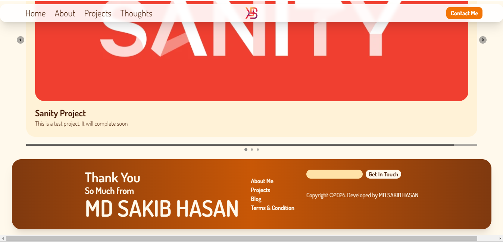

# Responsive Portfolio Website By sakib3046

## Tech Stack:
- CMS: Sanity
- Design: Tailwind & Core CSS
- Framework: Sveltekit
- Language: TypeScript

## About
I have developed the portfolio website during my learning periods of Svelte and Sanity. It's a one page website with minimal look. It's Totally Responsive across multiple Devices. Such as- Android, ios, Windows, Linux etc. with deferent screen size. 

## Screenshots

### Thank You so much